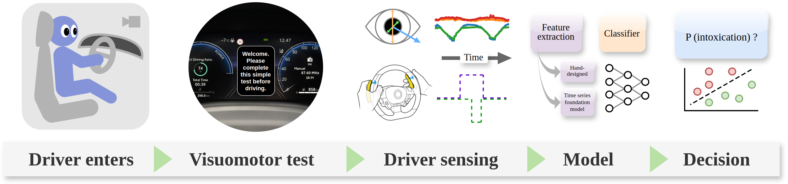

# Beyond Breathalysers: <br> Towards Pre-Driving Sobriety Testing with a Driver Monitoring Camera

Presented at IEEE Intelligent Vehicles Symposium, 2025.

[webpage](https://toyotaresearchinstitute.github.io/IV25-beyond-breathalysers/) | [poster](./docs/IV25stent_poster.pdf) | [paper](./docs/IV25stent.pdf) | [dataset download request](https://docs.google.com/forms/d/e/1FAIpQLScouxH8yrI5gPifoJYOUx8q0_PIgGXbwwXkH7jTHvMdIUfPog/viewform)



Field sobriety tests and breathalyzers are commonly used to prevent alcohol-impaired driving, but are expensive and time-consuming to administer. We propose a set of sobriety tests which, in contrast, can feasibly be automated and deployed to modern vehicles equipped with a driver monitoring camera. Our tests are inspired by research on the physiological effects of alcohol, with particular focus on eye movements and gaze behavior. We run an exploratory in-lab study with N=51 subjects (20 alcohol-impaired, 31 control), and train a variety of models to detect alcohol impairment. We find that, using only 10 seconds of observations of the driver, one of the four proposed tests performs comparably to existing non-breathalyzer field sobriety tests.

## Setup

### Install [micromamba](https://mamba.readthedocs.io/en/latest/installation/micromamba-installation.html) environment

```
# This will install micromamba to the default location
"${SHELL}" <(curl -L micro.mamba.pm/install.sh)  < /dev/null
source ~/.bashrc  # Or ~/.zshrc if you are using it, to refesh your shell
micromamba env create -f environment.yml
```
Activate the environment by running
```
micromamba activate IV25
```
To use this environment within Jupyter Lab, run
```
ipython kernel install --user --name=IV25
```
Note - `environment_IV25.yml` contains the explicit environment used for IV25 experiments.

### Pip install repo into micromamba environment

Finally, with the micromamba env active, run the following:
```
pip install -e . --config-settings editable_mode=compat
```

### Download the dataset

The dataset uses less than 700 MB when uncompressed.

[Register your email to get a download link](https://docs.google.com/forms/d/e/1FAIpQLScouxH8yrI5gPifoJYOUx8q0_PIgGXbwwXkH7jTHvMdIUfPog/viewform)
or send an email to `sistent@cantab.net`.

Once downloaded, unzip the data and save it or symlink it to `~/data/IV25alcohol/` (so that the per-subject data will be visible at `~/data/IV25alcohol/Participants/`).

## Experiments

Logging uses weights & biases: run `wandb login` from the commandline to log in to your account.

The experiments to reproduce the quantitative results in the paper can be run through the `code/run_experiments.sh` script.

See the [experiments notebook](code/experiments.ipynb) to reproduce the paper figures (make sure to run within the `IV25` environment).

Note that minor numerical variations may occur due to differences in GPU hardware, driver versions, or CUDA libraries.
Tested using Ubuntu 22.04.

## Reference

If using this code or data, please cite:
```
@inproceedings{stent25iv,
    author    = {Stent, Simon and Gideon, John and Tamura, Kimimasa and Balachandran, Avinash and Rosman, Guy},
    title     = {Beyond Breathalysers: Towards Pre-Driving Sobriety Testing with a Driver Monitoring Camera},
    booktitle = {IEEE Intelligent Vehicles Symposium (IV)},
    year      = {2025}
}
```